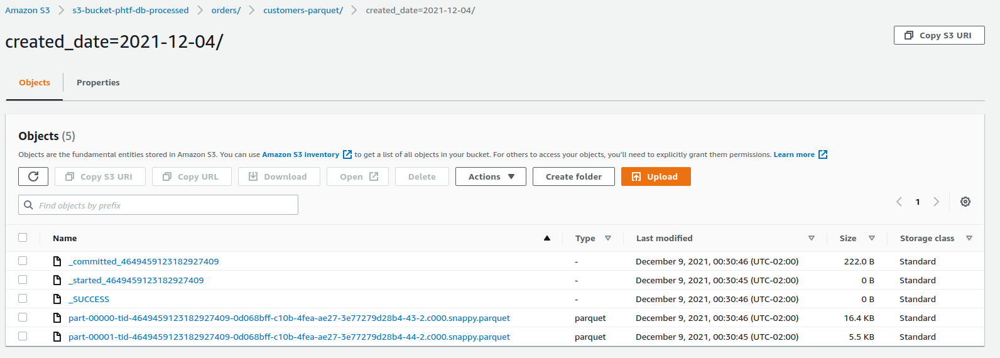
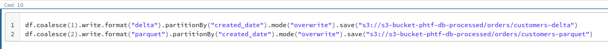
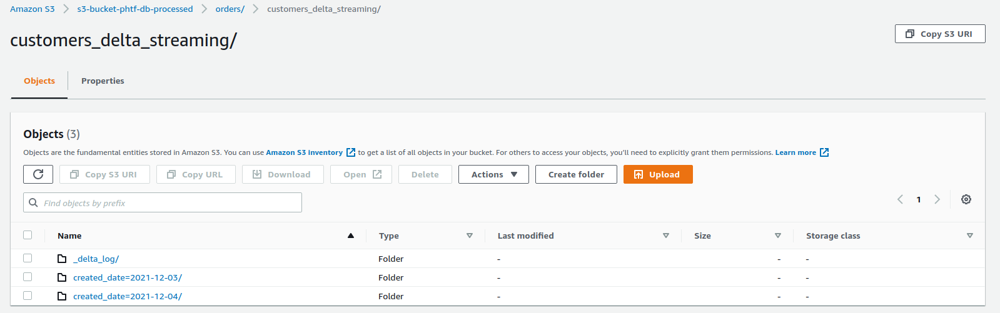

# Delta Lake Design

## Introduction

This project was developed to simulate a development of a delta lake enviroment. The bronze layer was from raw parquet files created by a relational database migration service (it was migrated in [this](https://github.com/pedro-tofani/data-lake-example) project). The silver layer was built to store the processed data using Spark in delta/parquet formats. The Spark cluster was managed by Databricks and several kinds of processing were done, for educational porpouses. The data was saved into silver bucket in delta or parquet formats using batch or stream processing.

"spark.ipynb" file will contain the work done. Databricks's Spark cluster also provides a HTML version of the notebook (spark.html).

##### Infrastructure:
* S3 bucket: where the parquet files are stored
* RDS instance: a postgres instance that the data will be copied from.
* DMS instance: a database migration service that will be used to copy the data from the RDS instance to the S3 bucket.
* Spark cluster: a Spark cluster managed on Databricks that will be used to process the files.

##### Discussion:

Delta lakes are not only the place where you can store your files. It envolves all of the eviroment that you need to store, process, manipulate, provide acces, serve and visualize the data. This picture, taken from this [post](https://aws.amazon.com/blogs/big-data/build-an-aws-well-architected-environment-with-the-analytics-lens/) can be used to  show differents aspects of the data enviroment. 

Usaually the data lake store is composed of three layers:
* Raw/Bronze layer: it is where the data is first stored whith no transformation. It is kind of the source of the truth. Generally it is partiotioned by extraction date.

* Processed/Staged/Silver: it is the result of the ETL from all the data stored at the raw layer. Generally it is stored as parquet or delta format, and are optmized for reading. They are partitioned by the column that matters for aggregating and filtering the data.

* Curated/Enriched/Gold: it is the result of the ETL of the silver layer. The data is processed in a way that is aggregated and ready to be analyzed by external tools such as Power BI, Tableau and so on. Busineess rules are applied to the data.

##### Project overview

First thing that was done was to create a Spark cluster on Databricks that could connect to S3 bucket.

Within this spark cluster was created a notebook (spark.ipynb), where the spark tecnology was used.

The steps followed were:
* Listing the raw bucket layer

* Reading the parquet files from raw bucket layer and checking which customers registry were updated

So there were 499 registers, with 35 row updates.

* Checking how an updated custumer is listed on the database. It has a column called "Op"

* Our first transform operation. Columns extracted_at, created_at, etl_timestamp and source_filename were added to provide more information.

* To save the transformed data to the silver lake was used this command

Two folders were creaed into silver layer buck, just for educational porpouses. One we saved one file in delta format and in the other was saved two files in parquet files.

Parquet folder (notice that it is partioned by creation date and there are two files in each partition):

Delta folder  (notice that it is partioned by creation date and there is one file in each partition):

* Reading the data from the silver layer ("s3-bucket-phtf-db-processed/orders/customers-delta" and "s3-bucket-phtf-db-processed/orders/customers-parquet")

* Overwriting data in parquet mode and delta mode

One of the differences between parquet files and delta files is that delta files keeps a log of all the versioning done, while parquet files simply overwrites the file. Note that delta files has two files, same size, one for each version and parquet folder has two files that has overwitten the other two files (parquet folder was coalesced in two files).

* Creating a stream to the silver layer

With this we created another folder into our silver bucket using a stream process.

* Creating a stream triggered once

* Creating another folder into our silver bucket, buut this time we deduplicated the rows that were updated.

Here we used a strem microbatch to check if the user has been updated and in case so no new row is inserted. Simply the ost rcent values replaces the old ones. We can see that it worked because initially there were 499 registers and now there are 464 registers. If we check the aggregation we did at the bronze bucket (see some picture bellow) the result is 499 rows with 35 updates, leaving us with 464 registers.

* All folders created:

## Tecnologies and tools used
* Language: Python 3.8
* AWS Services: RDS, DMS, S3, IAM, Spark
* Database: Postgrees
* Databricks: Cluster Spark

